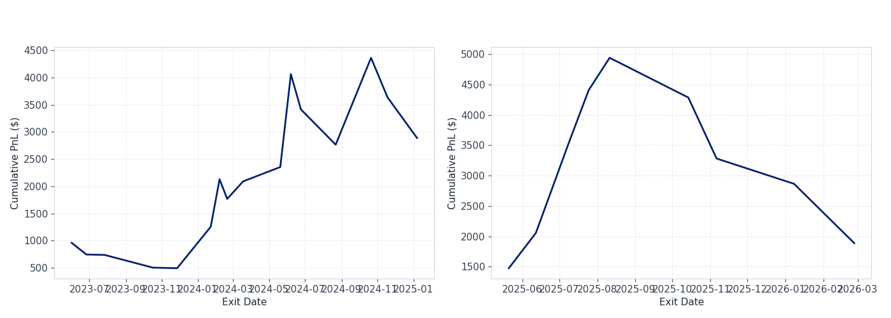
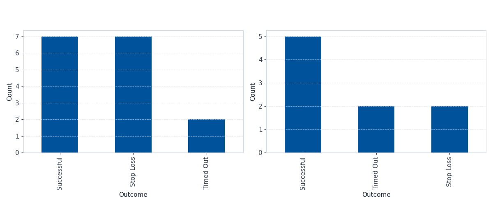

**Course:** FINTECH 533

**Topic:** Breakout Trading Strategy

**Asset:** NVDA

**Data Source:** IBKR via ShinyBroker

# Overview

This project backtests a simple breakout trading strategy on NVDA using daily price data pulled from IBKR via ShinyBroker. The idea is pretty straightforward: enter long when price clears a recent high, and exit either at a stop-loss or after a fixed holding period.

I kept the implementation simple on purpose - no fancy filters, just a clean entry rule with defined exits so the results are easy to trace and explain.

# Strategy Logic

The strategy goes long when the closing price exceeds the highest high of the past 20 trading days - the idea being that a new 20-day high suggests momentum is picking up and price might continue in the same direction. Once in a trade, there are two ways to exit: a 5% stop-loss below the entry price, or a forced close after 10 trading bars if the stop hasn't been hit. Only one position is held at a time, so new signals are skipped until the current trade closes.

# Asset Selection

I chose **NVDA (NVIDIA Corporation)** for this backtest.

Before picking NVDA I checked a few other candidates - SPY, TSLA, and AMD. SPY barely generates signals because it moves slowly; TSLA had plenty of breakouts but a lot of them reversed quickly. NVDA had the cleanest combination of frequent signals and actual follow-through, especially during 2023-2024. Breakout logic tends to work better on stocks that actually trend, so it seemed like the right fit.

# Breakout Definition

A breakout is defined as:

> today's closing price is greater than the highest high of the previous 20 trading days

The full set of parameters:

- **Asset:** NVDA
- **Lookback window:** 20 trading days
- **Entry rule:** Close > previous 20-day high
- **Direction:** Long only
- **Stop-loss:** 5% below entry price
- **Timeout exit:** 10 trading bars (not calendar days)
- **Position size:** 100 shares per trade

# Data and Assumptions

Daily bar data was downloaded from IBKR through ShinyBroker, covering roughly three years of history.

A few simplifying assumptions were made to keep things clean:

- no commissions
- no slippage
- trades execute at the observed closing price
- daily bars only
- only one open position at a time

If the daily low dips below the stop-loss level on a given bar, the trade is assumed to exit at the stop price that day.

# Walk-Forward Design

To reduce overfitting risk, the backtest is split into two non-overlapping windows:

- **In-sample (~2 years):** used to confirm the parameters make sense
- **Out-of-sample (~1 year):** held out entirely, tested with the same parameters unchanged

The equity curve and metrics below are reported separately for each window. The out-of-sample results are the ones that actually matter.

# Backtest Results

## Equity Curve

In-sample and out-of-sample cumulative P&L shown side by side.



## Trade Outcome Analysis

Each trade falls into one of three buckets:

- **Successful:** closed with a profit
- **Timed Out:** hit the 10-bar limit, closed at market regardless of P&L
- **Stop Loss:** exited when the 5% stop was triggered



# Performance Metrics

```{python}
#| echo: false
import pandas as pd
metrics = pd.read_csv("outputs/metrics_summary.csv")
metrics
```

## Metric Notes

- **Average Return per Trade** - mean return across all completed trades
- **Annualized Sharpe Ratio** - annualized using `sqrt(trades_per_year)` estimated from the date range, not `sqrt(252)`, since returns are per-trade with variable holding periods. Risk-free rate assumption: **3.75% annually** (RISK_FREE_RATE = 0.0375)
- **Win Rate** - fraction of trades that closed with positive P&L
- **Profit Factor** - gross profit divided by gross loss; above 1.0 means winners outweigh losers in dollar terms
- **Max Drawdown ($)** - largest peak-to-trough drop in cumulative P&L
- **Total Trades** - number of completed trades in each window

# Trade Blotter

Full trade log below. `holding_bars` is trading days held; `calendar_days_held` is calendar days between entry and exit.

```{python}
#| echo: false
import pandas as pd
trades = pd.read_csv("outputs/trade_blotter.csv")
trades
```

[Download Trade Blotter CSV](outputs/trade_blotter.csv)

# Discussion

NVDA had a strong trending run through most of the backtest period, which gave a momentum-based entry favorable conditions. The profit factor holding above 1.0 in both windows - despite a win rate under 50% in-sample - means the winning trades were large enough to cover the losers. That's fairly typical for breakout strategies: you get stopped out often but occasionally catch a real move.

The stop-loss is doing a lot of the risk management. Several trades got cut within a few days, which kept individual losses contained. The timeout exit is blunter - a few of those timed-out trades were nearly flat, and a longer holding window might have changed the outcome, though it's hard to say without testing it.

The out-of-sample window is the more honest read on whether the signal actually has edge. In-sample results on a trending stock during a bull run aren't that surprising. Main things to keep in mind: no slippage or commissions modeled, single asset, no regime filter. The Sharpe around ~0.95 is reasonable but per-trade annualization can distort the number relative to a proper daily MTM series, so take it as directional.

# Reproducibility

All output files are generated by the Jupyter notebook and saved to the `outputs/` folder:

- `outputs/trade_blotter.csv`
- `outputs/metrics_summary.csv`
- `outputs/equity_curve.png`
- `outputs/trade_outcomes.png`

## Code Availability

[View full notebook/code walkthrough](breakout_strategy.html)
